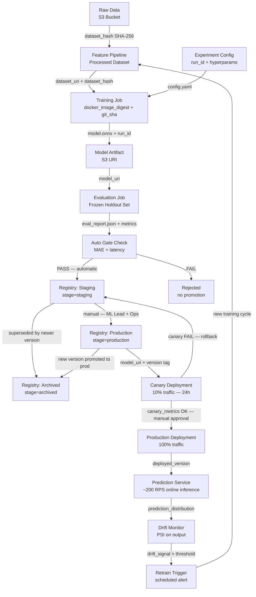

# ETA Model Lifecycle

## Transition Legend

| Transition | Type |
|---|---|
| Feature Pipeline → Training Job | Automatic |
| Evaluation → Registry Staging | Automatic (gate must pass) |
| Staging → Production | **Manual** (ML Lead + Ops approval) |
| Production → Canary Deployment | Automatic |
| Canary → Production Deployment | **Manual** (canary metrics review) |
| Canary FAIL → Rollback to Staging | Automatic |
| Production → Archived | Automatic (on new version promotion) |
| Drift Monitor → Retrain Trigger | Automatic (threshold breach) |

## Artifacts on Each Arrow

| Arrow | Artifact |
|---|---|
| Raw Data → Feature Pipeline | `dataset_hash` (SHA-256) |
| Feature Pipeline → Training Job | `dataset_uri`, `dataset_hash` |
| Experiment Config → Training Job | `run_id`, `git_sha`, `config.yaml` |
| Training Job → Model Artifact | `model.onnx`, `run_id` |
| Model Artifact → Evaluation Job | `model_uri` |
| Evaluation Job → Gate Check | `eval_report.json`, `mae`, `p95_latency_ms` |
| Gate Check → Staging | `model_uri`, `eval_report_uri` |
| Staging → Production | `approved_version`, `approver_id` |
| Production → Canary | `model_uri`, `version_tag` |
| Canary → Production | `canary_report.json` |
| Prediction Service → Drift Monitor | `prediction_distribution` (rolling 1h window) |
| Drift Monitor → Retrain Trigger | `drift_signal`, `psi_score` |